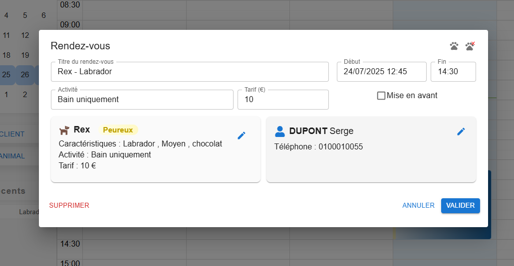

# Agenda et rendez-vous

## L'agenda

- Vue **semaine ouvrée** (lundi → vendredi), de **8 h à 19 h**, par créneaux de 15 minutes.
- Changer de semaine : flèches de l'agenda ou clic sur un jour du mini-calendrier de gauche
  (la semaine affichée y est surlignée).
- Les **jours fériés** français (fixes et mobiles : Pâques, Ascension, Pentecôte) sont colorés en orange.

Chaque rendez-vous affiche son titre, l'activité prévue et, si l'animal n'est pas « RAS », une
pastille de comportement :

| Couleur | Signification |
|---|---|
| Fond bleu | rendez-vous associé à un animal |
| Fond gris | rendez-vous libre (sans animal associé) |
| Fond rouge | rendez-vous **mis en avant** |
| Liseré gauche rouge / orange / jaune | animal *Agressif* / *Gueulard* / *Peureux* |

## Créer un rendez-vous

1. Sélectionner un créneau dans l'agenda (clic-glisser sur la durée voulue).
2. Dans la fenêtre **Rendez-vous**, associer l'animal :
   - 🐾 **Associer un animal** : ouvre la [recherche d'animal](./recherche.md) en mode sélection ;
   - 👤+ **Créer un nouveau client/animal** : saisie d'un nouveau client avec son premier animal,
     qui est ensuite associé au rendez-vous.
3. Le titre, le comportement, l'activité et le tarif sont pré-remplis depuis la fiche de l'animal ;
   ils restent modifiables pour ce rendez-vous.
4. **Valider**.

Un rendez-vous peut aussi rester libre (sans animal), avec un simple titre : pause, rendez-vous
personnel, etc.

## Champs d'un rendez-vous

| Champ | Usage |
|---|---|
| Titre | libre ; par défaut `Animal (Client) - Race` |
| Activité | prestation prévue (reprend l'activité par défaut de l'animal) |
| Tarif (€) | reprend le tarif habituel de l'animal |
| Début / Fin | lecture seule : se modifient dans l'agenda |
| Mise en avant | affiche le rendez-vous en rouge |

Quand un animal est associé, sa fiche et celle de son client apparaissent en bas de la fenêtre et
sont modifiables directement (icône d'édition).

## Modifier, déplacer, supprimer

- **Modifier** : clic sur le rendez-vous.
- **Déplacer** : glisser-déposer dans l'agenda ; **changer la durée** : tirer le bas du rendez-vous.
- **Dissocier l'animal** : icône 🐾 barrée ; le rendez-vous redevient libre et ses champs sont vidés.
- **Supprimer** : bouton **Supprimer** de la fenêtre (rendez-vous existant uniquement).

L'activité et le tarif réellement pratiqués peuvent aussi être corrigés après coup depuis
l'historique de la [fiche de l'animal](./clients-animaux.md#historique-des-rendez-vous).
