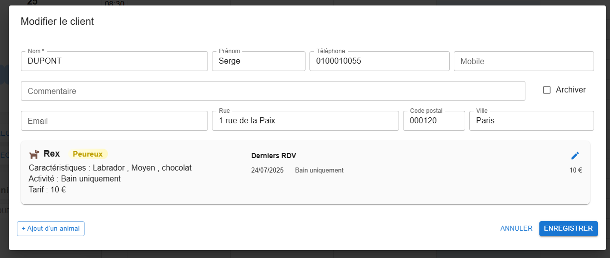

# Clients et animaux

## Fiche client

Ouverte depuis la [recherche client](./recherche.md), depuis un rendez-vous ou depuis la fiche d'un animal.

| Champ | Remarque |
|---|---|
| Nom, Prénom | |
| Rue, Code postal, Ville | |
| Téléphone, Mobile, Email | le téléphone et le mobile servent à la recherche |
| Commentaire | note libre |
| Archiver | client qui ne vient plus : masqué par défaut dans les recherches, rien n'est supprimé |

La fiche liste les animaux du client (les animaux décédés en dernier) ; un animal s'y ajoute ou
s'y ouvre directement.

## Fiche animal

| Champ | Valeurs |
|---|---|
| Nom de l'animal, Espèce | **obligatoires** ; espèce : Chien, Chat, NAC, Autre |
| Race, Couleur, Date de naissance | libres |
| Taille | Nain, Moyen, Grand |
| Comportement | RAS, Agressif, Gueulard, Peureux : affiché en couleur dans l'agenda |
| Activité / Description | prestation habituelle, reprise par défaut dans les nouveaux rendez-vous |
| Tarif (€) | tarif habituel, repris par défaut dans les nouveaux rendez-vous |
| Décédé | l'animal reste dans l'historique, mais est masqué par défaut dans les recherches |

### Historique des rendez-vous

La partie **Rendez-vous de l'animal** liste ses rendez-vous, du plus récent au plus ancien, 6 par
page. L'activité et le tarif de chaque rendez-vous y sont modifiables : utile pour noter ce qui a
réellement été fait et facturé. Les corrections sont enregistrées avec la fiche.

## Animaux récents

La colonne de gauche de l'écran principal liste les derniers animaux créés ou modifiés : un clic
ouvre leur fiche sans passer par la recherche.
