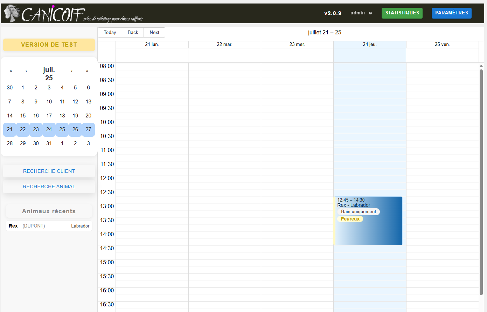

# Canicoif

Canicoif est une application web de gestion des rendez-vous pour un salon de toilettage :
agenda de la semaine, fiches clients et animaux, historique des soins, statistiques.

Les données (clients, animaux, rendez-vous) restent dans une base MongoDB **locale**, hébergée
avec l'application : rien n'est envoyé à un service externe.

## Principes

- **Accès par navigateur**, après connexion avec un compte utilisateur (voir [Administration](./administration.md)).
- **Un animal appartient à un client** ; un client peut avoir plusieurs animaux.
- **Un rendez-vous est un créneau de l'agenda**, associé de préférence à un animal : il reprend alors
  automatiquement le nom de l'animal, celui du client, la race, le comportement, l'activité et le tarif habituels.
- **Rien ne se perd** : un client qui ne vient plus est *archivé*, un animal disparu est marqué *décédé*.
  Ils restent consultables mais sont masqués par défaut dans les recherches.

## L'écran principal

| Zone | Contenu |
|---|---|
| Bandeau (haut) | version de l'application, utilisateur connecté et déconnexion (⎋), boutons **Statistiques** (si activées) et **Paramètres** (administrateurs) |
| Colonne de gauche | mini-calendrier (choix de la semaine), boutons **Recherche client** et **Recherche animal**, liste des **animaux récents** (derniers modifiés, clic = fiche de l'animal) |
| Zone principale | [agenda de la semaine](./agenda.md), du lundi au vendredi, de 8 h à 19 h |

Un bandeau jaune **VERSION DE TEST** s'affiche dans la colonne de gauche sur une instance de test :
les données saisies n'y sont pas celles du salon.

## Sommaire

- [Agenda et rendez-vous](./agenda.md)
- [Clients et animaux](./clients-animaux.md)
- [Recherche](./recherche.md)
- [Administration](./administration.md) : connexion, utilisateurs, mots de passe, paramètres, statistiques
