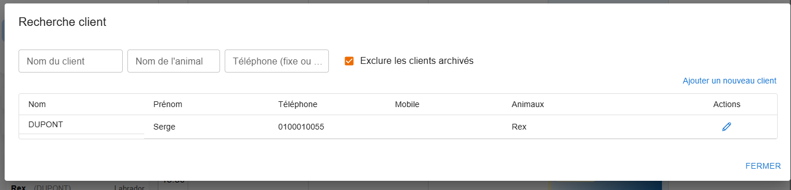
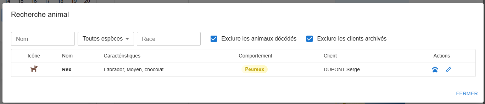

# Recherche

Deux boutons de la colonne de gauche : **Recherche client** et **Recherche animal**. Les résultats
se mettent à jour pendant la saisie.

## Recherche client

| Critère | |
|---|---|
| Nom du client | |
| Nom de l'animal | retrouve un client par le nom d'un de ses animaux |
| Téléphone (fixe ou mobile) | |
| Exclure les clients archivés | coché par défaut |

Chaque résultat affiche le client (badge si archivé) et ses animaux vivants ; un clic ouvre la
[fiche client](./clients-animaux.md#fiche-client).

## Recherche animal

| Critère | |
|---|---|
| Nom de l'animal | |
| Espèce | Toutes espèces, Chien, Chat, NAC, Autre |
| Race | |
| Exclure les animaux décédés | coché par défaut |
| Exclure les clients archivés | coché par défaut |

Chaque résultat affiche l'espèce (icône), le nom, la race, la taille, la couleur et le client.
Un clic ouvre la [fiche de l'animal](./clients-animaux.md#fiche-animal) ; depuis un rendez-vous
(bouton 🐾), le clic **associe** l'animal au rendez-vous.

